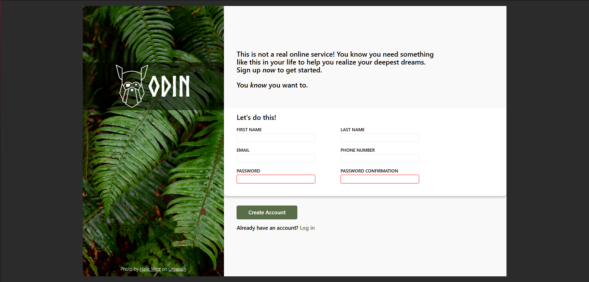

# The Odin Project Sign-Up form

Live preview : https://yvesb22.github.io/sign-up-form-css-project/

## Description
The project : [The Odin Project](https://www.theodinproject.com/lessons/node-path-intermediate-html-and-css-sign-up-form)
 
 
Recreation of a provided sign-up form design while practicing HTML and CSS concepts.  
The goal is to closely match or take inspiration from the layout and style of the original mockup.

## Technologies
- HTML5 : Page structure
- CSS3 : Visual design

## Features
- Responsive layout using Flexbox to create a two-panel design.
- Custom font integration.
- Background image with overlay for improved text legibility.
- Form with semantic HTML5 inputs, including validation attributes (required, minlength, maxlength).
- Visual feedback on input states:
  - Red border on invalid password inputs.
  - Blue border and subtle shadow on focused inputs.
- Styled buttons with hover and active states for better UX.
- Use of Normalize.css to ensure consistent styling across browsers.

## Additional Information
- No JavaScript : All validations and interactivity rely solely on HTML5 and CSS.
- No media queries : This project is not optimized for mobile devices.
- Project completed with no plans for further updates.

## License
[MIT License](LICENSE) 
Open source and freely usable for personal or commercial projects. 

## Acknowledgements
- This project uses the **Norse Bold** font by Joël Carrouché, which is free for personal and commercial use.  
- It also includes **Normalize.css**, a CSS reset by Nicolas Gallagher and Jonathan Neal that helps make styles consistent across browsers.